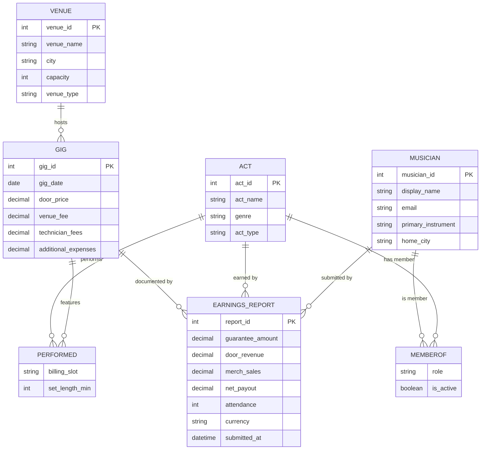

# GigShare — A Data Platform for Pooling Live-Music Earnings

**CSC 370 · Databases · Summer 2026 · University of Victoria**
Sprint 0 deliverable: *Requirements & Basic Conceptual Design*

---

## 1. Overview

### The problem
Among the many relationships in the live-music industry, **the musicians themselves
tend to hold the weakest position.** Margins on live performance keep shrinking:
venues increasingly charge door/cover fees, take larger cuts, shift risk onto acts
(e.g. "pay-to-play", unfavourable door splits), and there is almost no shared visibility
into what a fair deal actually looks like. Each act negotiates alone, in the dark, with
no reference data.

### The idea
**GigShare** is an information system that lets musicians **pool the final earnings
reports from their live gigs**. By contributing their own numbers, members gain access
to aggregated, anonymised benchmarks across the community. This turns thousands of
private, siloed payout slips into a shared dataset that musicians can use to:

- **Develop high-level strategy** — which venues, cities, nights, or billing slots
  actually pay, and which don't.
- **Run data analytics** — average payout per head, door-split norms by venue capacity,
  seasonality of earnings, merch-vs-door revenue ratios, etc.
- **Advocate and lobby** — walk into a booking negotiation (or a policy discussion about
  live-music funding) with hard, collective evidence instead of anecdotes.

The core shareable unit of data is the **earnings report**: what an act was actually paid
for a specific performance at a specific venue, plus the surrounding financial context
(guarantee, door split, attendance, merch, expenses).

### Who uses it
| Stakeholder | What they do with the system |
|---|---|
| **Individual musician** | Submits earnings reports for their acts; browses benchmarks. |
| **Act / band** | The performing unit a report is attributed to. |
| **The community (aggregate)** | Consumes anonymised analytics and benchmarks. |
| *(future)* **Advocacy org / researcher** | Exports aggregate trends for lobbying. |

---

## 2. Requirements

Following the course method (*"what should the system do?"* → *"what data must we
maintain to do it?"*), requirements are split into **application/functional**
requirements and the **business rules** that constrain them.

### 2.1 Before the course (baseline)
> Per the kick-off rubric, we contrast against the empty list we started with.

- **Requirements identified before CSC 370:** *(none — no formal requirements gathered)*

### 2.2 Application / functional requirements
What a user should be able to do:

1. Register as a musician and create or join one or more **acts** (bands/projects).
2. Record a **gig**: the venue, the date, ticket price / cover charge.
3. Submit an **earnings report** for a gig: guarantee, door revenue, merch sales,
   expenses, net payout, attendance.
4. Edit or delete an earnings report they submitted.
5. View **their own** earnings history across gigs, acts, and venues.
6. View **aggregated, anonymised** benchmarks contributed by others
   (e.g. average payout per attendee at venues of a given capacity).
7. Search / filter gigs and reports by **venue, city, date range, capacity, genre**.
8. Compute analytics: average net payout per gig, per head, per venue;
   totals per act; trends over time.
9. Compare an act's numbers against the community benchmark.
10. *(future)* Flag suspicious/outlier reports; verification of reports.

### 2.3 Business rules / constraints
Rules the data must obey (these become multiplicities & integrity constraints later):

- A musician can belong to **many** acts; an act has **many** members.
- A gig happens at **exactly one** venue; a venue hosts **many** gigs.
- An act can perform at **many** gigs; a gig can feature **many** acts
  (headliner + support).
- An **earnings report** describes the money **one act** made at **one gig**, and is
  **submitted by one musician** → at most **one report per (act, gig)** pair.
- Reports contribute to aggregates only in **anonymised** form.

### 2.4 Data requirements (derived)
To support the features above we must maintain data about: **musicians**, **acts**,
**membership** (who is in which act), **venues**, **gigs** (a performance event at a
venue), and **earnings reports** (the financial outcome of an act at a gig).

---

## 3. Basic Conceptual Design (ERD)

Following the notes, the conceptual model is an **Entity-Relationship Diagram** in
(approximately) **Chen notation**:

- **Entity set** → rectangle
- **Attribute** → ellipse; the **identifier** is <u>underlined</u>
- **Relationship** → diamond; attributes may hang off relationships when they describe
  the *connection* rather than either entity
- **Multiplicity** → each entity–relationship edge is labelled `(min-card, max-card)`
  (Batini min/max-card notation from the Multiplicity notes): the minimum and maximum
  number of times an instance of that entity participates in the relationship. `N` = "many".

### 3.1 Diagram (Chen notation)

The authoritative conceptual model, in the course's Chen notation — entity sets
(rectangles), attributes (ellipses, **identifiers underlined**), and relationships
(diamonds). Source: [`docs/erd-chen.dot`](docs/erd-chen.dot)
(render with `dot -Tsvg docs/erd-chen.dot -o docs/erd-chen.svg`).

### 3.1b Diagram (Mermaid rendering aid)

> The Mermaid diagram below is a convenience rendering (crow's-foot style) that displays
> inline on GitHub without a build step. The **Chen diagram above is authoritative.**

### 3.2 Entity sets, attributes & identifiers (authoritative, Chen-style)

Identifier attributes are marked **(id)** and would be **underlined** in the drawn ERD.

**Musician** — an individual person who uses the platform.
| Attribute | Notes |
|---|---|
| `musician_id` **(id)** | surrogate identifier |
| `display_name` | |
| `email` | candidate natural identifier (unique) |
| `primary_instrument` | |
| `home_city` | |

**Act** — a performing unit (solo project or band) that a report is attributed to.
| Attribute | Notes |
|---|---|
| `act_id` **(id)** | |
| `act_name` | |
| `genre` | |
| `act_type` | e.g. `solo`, `duo`, `band` |

**Venue** — a place that hosts live performances.
| Attribute | Notes |
|---|---|
| `venue_id` **(id)** | |
| `venue_name` | |
| `city` | |
| `capacity` | key driver of benchmarking (payout per head, etc.) |
| `venue_type` | e.g. `bar`, `club`, `theatre`, `festival` |

**Gig** — a live-performance event held at one venue on a date.
| Attribute | Notes |
|---|---|
| `gig_id` **(id)** | |
| `gig_date` | |
| `door_price` | what a patron pays to get in — covers both "cover charge" and "ticket price" (consolidated: a gig uses one entry-fee model, so two columns would be redundant) |
| `venue_fee` | what the venue charges the act to play. Lives on **Gig**, not Venue, because these are sliding/negotiated and change gig-to-gig — central to the platform's thesis |
| `technician_fees` | sound/lighting/tech cost for staging the show |
| `additional_expenses` | catch-all for other event-level costs of putting on the gig |

**EarningsReport** — the financial outcome for **one act** at **one gig**. This is the
core shareable unit of data.
| Attribute | Notes |
|---|---|
| `report_id` **(id)** | |
| `guarantee_amount` | flat fee promised, if any |
| `door_revenue` | act's share of the door |
| `merch_sales` | |
| `net_payout` | what the act actually took home |
| `attendance` | heads through the door |
| `currency` | |
| `submitted_at` | |

**Design note (where do fees live?).** The costs of staging a show —
`venue_fee`, `technician_fees`, `additional_expenses` — plus `door_price` sit on
**Gig**, because they are event-level facts of putting on that gig, the same regardless
of which act reports it. The **EarningsReport** holds the act's revenue side and bottom
line: `guarantee_amount`, `door_revenue`, `merch_sales`, and the resulting `net_payout`.
Roughly, an act's `net_payout ≈ guarantee + door_revenue + merch_sales − (its share of
the gig's costs)`. *Open nuance for a later module:* when a gig has multiple acts, how the
gig-level costs are split across their reports — deferred to logical design / normalization.

### 3.3 Relationships & multiplicities

Multiplicity is read as `(min-card, max-card)` for **each side's** participation.

| Relationship | Connects | Multiplicity | Kind | Attributes |
|---|---|---|---|---|
| **MemberOf** | Musician ⟷ Act | Musician `(0,N)` — Act `(1,N)` | many–many | `role`, `is_active` |
| **HostedAt** | Gig ⟶ Venue | Gig `(1,1)` — Venue `(0,N)` | many–one | — |
| **Performed** | Act ⟷ Gig | Act `(0,N)` — Gig `(1,N)` | many–many | `billing_slot`, `set_length_min` |
| **Documents** | EarningsReport ⟶ Gig | Report `(1,1)` — Gig `(0,N)` | many–one | — |
| **EarnedBy** | EarningsReport ⟶ Act | Report `(1,1)` — Act `(0,N)` | many–one | — |
| **SubmittedBy** | EarningsReport ⟶ Musician | Report `(1,1)` — Musician `(0,N)` | many–one | — |

**Why these multiplicities (tied to the business rules in §2.3):**
- **MemberOf** — a musician may currently be in **many** acts, or **none** yet `(0,N)`;
  an act must have **at least one** member and may have many `(1,N)`. ⇒ many–many.
- **HostedAt** — a gig happens at **exactly one** venue `(1,1)`; a venue hosts **many**
  gigs, or none `(0,N)`. ⇒ many–one (the "one" side is Venue).
- **Performed** — an act performs **many** gigs, or none yet `(0,N)`; a gig features
  **at least one** act, often several `(1,N)`. ⇒ many–many.
- **Documents / EarnedBy / SubmittedBy** — an earnings report is about **exactly one**
  gig, for **exactly one** act, filed by **exactly one** musician `(1,1)` on the report
  side; each gig/act/musician can be linked to **many** reports `(0,N)`. ⇒ many–one.

**Uniqueness constraint (beyond basic multiplicity):** at most **one** EarningsReport per
`(Act, Gig)` pair. This spans two relationships (`Documents` + `EarnedBy`) and so isn't
captured by a single edge's multiplicity; it will be enforced as a composite key /
`UNIQUE` constraint at logical design.

**Design note (attributes on relationships):** `role` describes the *connection* between
a Musician and an Act (not the person or the band alone), and `billing_slot` describes
the *connection* between an Act and a Gig — so, following the notes' `grade`-on-
`EnrolledIn` example, these live on the relationships rather than on an entity set.

**Design note (report as entity vs. relationship attributes):** the financial figures
could instead hang off the `Performed` relationship. We model `EarningsReport` as its
**own entity** because it has its own identity, submitter, and timestamp, and because it
gives us room to grow (verification status, revisions, multiple currencies) — deliberate
headroom for later, more complex modules.

---

## 4. Study Plan — How this project covers the course

The project is intentionally chosen to touch many modules, with clear levers to
increase complexity as competencies advance:

| Course area | How GigShare exercises it | Complexity lever |
|---|---|---|
| **Requirements / Data Architecture** | §2 requirements + business rules | add stakeholder roles (advocacy orgs, researchers) |
| **Conceptual design (ERD + multiplicity)** | §3 this deliverable — entities, identifiers, relationships, and `(min,max)` multiplicities | more entity sets: tours, tickets, expenses breakdown; weak entities |
| **Logical design / relational mapping** *(next)* | ERD → tables; `Performed`, `MemberOf` become join tables; multiplicities drive keys/FKs | normalization of address/city |
| **SQL (DDL + queries)** | `CREATE TABLE`s; benchmark queries (avg payout/head) | aggregation, `GROUP BY`, views |
| **Normalization** | split `city`/venue metadata, avoid anomalies | 3NF/BCNF analysis |
| **Analytics / advanced queries** | community benchmarks, trends over time | window functions, materialized aggregates |
| **Anonymisation / access control** | members see aggregates, not raw peer data | roles, permissions, privacy-preserving views |

### Data acquisition plan
We do not need real (sensitive) financial data to build and demo the system:
1. **Synthetic generation** — a seed script producing realistic gigs/venues/reports
   (plausible capacities, door splits, payouts) for development and analytics demos.
2. **Public reference points** — venue capacities and ticket prices from public listings
   to calibrate the synthetic distributions.
3. *(stretch)* a small **opt-in real submission** form once the schema stabilises.

---

## 5. Next Sprint Plan (Sprint 1 → *Logical Design & SQL*)

Basic Conceptual Design (entities, identifiers, relationships, **and multiplicities**)
is delivered in §3. The next sprint moves down a level: **map the conceptual model to a
relational schema and stand it up in MySQL.**

**Goals**
1. Map the ERD to a **relational schema**: entity sets → tables; `MemberOf` and
   `Performed` (many–many) → association tables; the many–one relationships
   (`HostedAt`, `Documents`, `EarnedBy`, `SubmittedBy`) → foreign keys on the "many" side.
2. Translate the multiplicities from §3.3 into concrete **keys and constraints** —
   including the `UNIQUE(act_id, gig_id)` rule of one report per act–gig.
3. Write the **`CREATE TABLE`** statements in MySQL and load a small **synthetic seed**.
4. Run ≥1 **benchmark query** (e.g. average net payout per attendee, grouped by venue
   capacity band).

**Success criteria (objectively measurable at sprint end)**
- A running MySQL instance with all tables created, keyed, and seeded.
- Foreign keys and the one-report-per-`(act, gig)` constraint verified (an offending
  `INSERT` is rejected).
- At least one benchmark query returns sensible results over the seed data.

**Course-competency mapping**
- *Logical design / relational mapping* → goals 1–2.
- *Basic SQL / DDL* → goal 3.
- *SQL queries / analytics* → goal 4, providing testable evidence for the video.

---

## 6. Repository & Submission

- **Repo:** https://github.com/rkachanoski/gigshare
- **Team:** solo (1 member — Reg Kachanoski).
- **Submission per sprint:** git link + commit hash + video. Video length limit for a
  solo project is `4 + 2.0 × 1 = 6.0` minutes (hard cap).
- **AI-use disclosure:** generative AI (Claude) assisted with drafting this requirements
  and conceptual-design document and structuring/rendering the ERD; all design decisions,
  requirements, and the project concept are the author's own. Detailed per-component
  attribution will be maintained here as the project grows.

---

## 7. Glossary

- **Act** — a performing unit (solo or band) that earnings are attributed to.
- **Gig** — one live-performance event at one venue on one date.
- **Earnings report** — the financial outcome of one act at one gig; the core shared datum.
- **Door split** — the agreed division of door/cover revenue between venue and act.
- **Guarantee** — a flat fee promised to an act regardless of attendance.
- **Payout per head** — net payout ÷ attendance; a key benchmarking metric.
</content>
</invoke>
