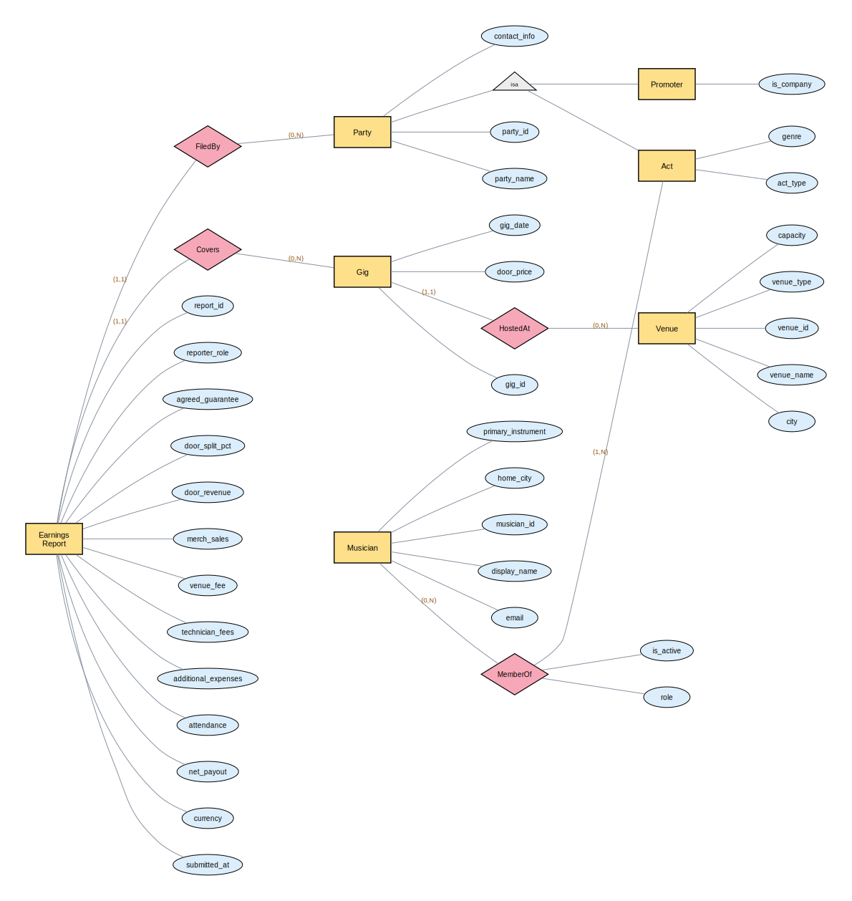
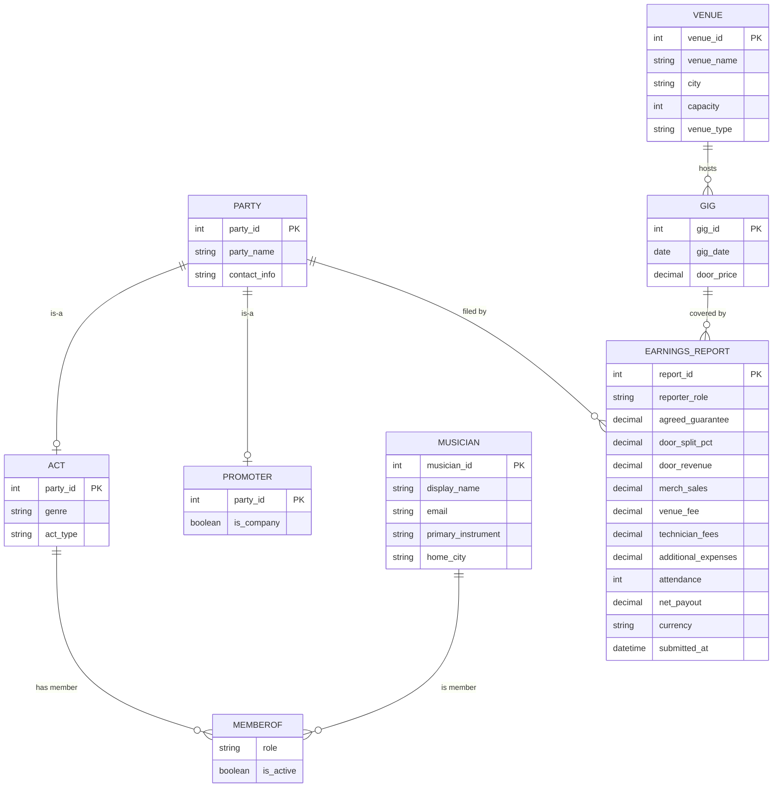

# GigShare — A Data Platform for Pooling Live-Music Earnings

**CSC 370 · Databases · Summer 2026 · University of Victoria**
Sprint 0 deliverable: *Requirements & Basic Conceptual Design*

---

## 1. Overview

### The problem
Among the many relationships in the live-music industry, **the musicians themselves
tend to hold the weakest position.** Margins on live performance keep shrinking:
venues increasingly charge door/cover fees, take larger cuts, shift risk onto acts
(e.g. "pay-to-play", unfavourable door splits), and there is almost no shared visibility
into what a fair deal actually looks like. Each act negotiates alone, in the dark, with
no reference data.

### The idea
**GigShare** is an information system that lets musicians **pool the final earnings
reports from their live gigs**. By contributing their own numbers, members gain access
to aggregated, anonymised benchmarks across the community. This turns thousands of
private, siloed payout slips into a shared dataset that musicians can use to:

- **Develop high-level strategy** — which venues, cities, nights, or billing slots
  actually pay, and which don't.
- **Run data analytics** — average payout per head, door-split norms by venue capacity,
  seasonality of earnings, merch-vs-door revenue ratios, etc.
- **Advocate and lobby** — walk into a booking negotiation (or a policy discussion about
  live-music funding) with hard, collective evidence instead of anecdotes.

The core shareable unit of data is the **earnings report**: what an act was actually paid
for a specific performance at a specific venue, plus the surrounding financial context
(guarantee, door split, attendance, merch, expenses).

### Who uses it
| Stakeholder | What they do with the system |
|---|---|
| **Individual musician** | Submits earnings reports for their acts; browses benchmarks. |
| **Act / band** | The performing unit a report is attributed to. |
| **The community (aggregate)** | Consumes anonymised analytics and benchmarks. |
| *(future)* **Advocacy org / researcher** | Exports aggregate trends for lobbying. |

---

## 2. Requirements

Requirements are derived by asking *"what should the system do?"* and then *"what data
must we maintain to do it?"*, and are split into **application/functional** requirements
and the **business rules** that constrain them.

### 2.1 Before the course (baseline)
> Per the kick-off rubric, we contrast against the empty list we started with.

- **Requirements identified before CSC 370:** *(none — no formal requirements gathered)*

### 2.2 Application / functional requirements
What a user should be able to do:

1. Register as a musician and create or join one or more **acts** (bands/projects).
2. Act as, or register, a **promoter** — a party that organises gigs and moves money.
3. Record a **gig**: the venue, the date, the advertised door price.
4. File an **earnings report** for a gig **as an act or as a promoter**: role/billing,
   agreed split terms, door revenue, merch, fees/expenses, net payout, attendance —
   filling in only what that party actually knows (partial reports allowed).
5. Edit or delete a report they filed.
6. See **all reports for one gig side by side** (e.g. the headliner's, the opener's, and
   the promoter's) and view a **reconciled** picture, with **discrepancies flagged**.
7. View **their own** earnings history across gigs, acts, and venues.
8. View **aggregated, anonymised** benchmarks contributed by others
   (e.g. average payout per attendee at venues of a given capacity).
9. Search / filter gigs and reports by **venue, city, date range, capacity, genre**.
10. Compute analytics: average net payout per gig, per head, per venue; totals per act;
    trends over time; and compare an act's numbers against the community benchmark.
11. *(future)* Verify/endorse another party's report; flag suspicious/outlier reports.

### 2.3 Business rules / constraints
Rules the data must obey (these become multiplicities & integrity constraints later):

- A musician can belong to **many** acts; an act has **at least one** member.
- A report is filed by a **party**, which is **either an act or a promoter** (a
  generalization — see §3).
- **A promoter is optional.** DIY / self-promoted shows have **no promoter** — the
  performing act deals with the venue directly and reports the venue-side figures
  (e.g. `venue_fee`, `door_split_pct`) on its **own** report.
- A gig happens at **exactly one** venue; a venue hosts **many** gigs.
- **A gig can be reported by many parties** — one or more acts, and *optionally* a
  promoter — each from their own perspective. So a gig has **many** earnings reports, but
  each report is about **one** gig and filed by **one** party.
- **One report per party per gig:** at most **one report per (party, gig)** pair — a party
  can't file two conflicting reports for the same show.
- **Gigs are deduplicated by `(venue, date)`** so that every party's report for the same
  show attaches to the **same** `Gig` — the mechanism that ties perspectives together and
  prevents duplicate/fragmented gig entries.
- **Financial figures are that reporter's own view and may be partial** (nullable):
  an opener may not know the `venue_fee`; a promoter's report will. Different parties'
  numbers for one gig may differ and are **reconciled, never overwritten**.
- Reports contribute to aggregates only in **anonymised** form.

### 2.4 Data requirements (derived)
To support the features above we must maintain data about: **musicians**, **parties**
(acts and promoters), **membership** (which musicians are in which act), **venues**,
**gigs** (deduplicated by venue + date), and **earnings reports** — one per party per
gig, holding that party's role, agreed split, and reported financials.

---

## 3. Basic Conceptual Design (ERD)

The conceptual model is an **Entity-Relationship Diagram** in (approximately)
**Chen notation**:

- **Entity set** → rectangle
- **Attribute** → ellipse; the **identifier** is <u>underlined</u>
- **Relationship** → diamond; attributes may hang off relationships when they describe
  the *connection* rather than either entity
- **Generalization** → an **`isa`** triangle links a supertype to its subtypes; subtypes
  **inherit the supertype's identifier** (here: `Party` ← `Act`, `Promoter`)
- **Multiplicity** → each entity–relationship edge is labelled `(min-card, max-card)`
  (Batini min/max-card notation), placed **next to the entity it describes**: the minimum
  and maximum number of times an instance of *that* entity participates in the
  relationship. `N` = "many". The side whose max is `1` is the "one" side of a many-one.
  This is equivalent to arrowhead many-one/one-one notation, but additionally captures
  the minimum (optional vs. mandatory participation).

> **Notation choice:** multiplicity is shown with min/max-card labels by the author's
> preference, since they also encode optionality. This can be switched to the arrowhead
> notation if the course requires it.

### 3.1 Diagram (Chen notation)

The authoritative conceptual model, in Chen notation — entity sets (rectangles),
attributes (ellipses, **identifiers underlined**), and relationships (diamonds).
Source: [`docs/erd-chen.dot`](docs/erd-chen.dot)
(render with `dot -Tsvg docs/erd-chen.dot -o docs/erd-chen.svg`).

### 3.1b Diagram (Mermaid rendering aid)

> The Mermaid diagram below is a convenience rendering (crow's-foot style) that displays
> inline on GitHub without a build step. The **Chen diagram above is authoritative.**

> Mermaid can't draw a true `isa` triangle, so the `PARTY → ACT / PROMOTER`
> generalization is shown here as plain "is-a" links. The Chen diagram above is
> authoritative for the generalization.

### 3.2 Entity sets, attributes & identifiers (authoritative, Chen-style)

Identifier attributes are marked **(id)** and would be **underlined** in the drawn ERD.

**Musician** — an individual person who uses the platform.
| Attribute | Notes |
|---|---|
| `musician_id` **(id)** | surrogate identifier |
| `display_name` | |
| `email` | candidate natural identifier (unique) |
| `primary_instrument` | |
| `home_city` | |

**Party** — *supertype*: any entity that can participate in a gig and file a report.
Generalized into **Act** and **Promoter** (via the `isa` triangle). Its identifier is
inherited by both subtypes.
| Attribute | Notes |
|---|---|
| `party_id` **(id)** | inherited by `Act` and `Promoter` |
| `party_name` | act name or promoter/company name |
| `contact_info` | |

**Act** — *subtype of Party*: a performing unit (solo project or band).
| Attribute | Notes |
|---|---|
| *(inherits `party_id`)* | identifier comes from `Party` |
| `genre` | |
| `act_type` | e.g. `solo`, `duo`, `band` |

**Promoter** — *subtype of Party*: a person or company that organises gigs and moves money.
**Optional** — a gig may have none (DIY / band-promoted shows); when absent, the act's own
report carries the venue-side figures.
| Attribute | Notes |
|---|---|
| *(inherits `party_id`)* | identifier comes from `Party` |
| `is_company` | individual promoter vs. a company |

**Venue** — a place that hosts live performances.
| Attribute | Notes |
|---|---|
| `venue_id` **(id)** | |
| `venue_name` | |
| `city` | |
| `capacity` | key driver of benchmarking (payout per head, etc.) |
| `venue_type` | e.g. `bar`, `club`, `theatre`, `festival` |

**Gig** — a live-performance event: the **shared anchor** every party's report attaches
to. Holds only objective, agreed facts.
| Attribute | Notes |
|---|---|
| `gig_id` **(id)** | surrogate identifier |
| `gig_date` | |
| `door_price` | advertised entry price — one public value (consolidates "cover charge" / "ticket price") |

> **Identity rule:** although `gig_id` is the identifier, a gig is *also* uniquely
> identified by **`(venue, gig_date)`** — a `UNIQUE` constraint that deduplicates gigs so
> every party's report for the same show resolves to the same `Gig`.

**EarningsReport** — **one per party, per gig**: that party's role, agreed split, and
reported financials. Multiple reports per gig (headliner + opener + promoter) are
expected and coexist; fields are that reporter's own view and may be **null** where
unknown.
| Attribute | Notes |
|---|---|
| `report_id` **(id)** | (also `UNIQUE(party_id, gig_id)` — one report per party per gig) |
| `reporter_role` | `headliner`, `support`, or `promoter` |
| `agreed_guarantee` | flat fee this party agreed to (deal term) |
| `door_split_pct` | this party's agreed share of the door (deal term) |
| `door_revenue` | door money this party actually received/handled |
| `merch_sales` | |
| `venue_fee` | *nullable* — often only the promoter/headliner knows it |
| `technician_fees` | *nullable* — sound/lighting/tech cost |
| `additional_expenses` | *nullable* — catch-all |
| `attendance` | *nullable* — heads through the door, as observed by this reporter |
| `net_payout` | this party's bottom line |
| `currency` | |
| `submitted_at` | |

**Design note (per-party reports, not one truth).** We no longer store a single
authoritative financial record per gig. Each report is a **claim from one party**, so a
band, an opener, and a promoter can each file for the same show without clobbering each
other. This makes partial data fine (an opener leaves `venue_fee` null) and turns
"conflicts" into a **read-time reconciliation** concern instead of a write-time one:
`UNIQUE(venue, gig_date)` ties all reports to one gig; `UNIQUE(party_id, gig_id)` stops a
party filing twice; disagreements between parties are **flagged, not overwritten**
(a reconciliation/verification layer is a planned later-module complexity lever).

**Design note (why a `Party` generalization).** Both acts and promoters file reports, so
the report's filer is a **`Party`** supertype specialized into `Act` and `Promoter` via an
`isa` triangle. This gives one clean `FiledBy` relationship and a single place to add new
party types later (e.g. a booking agent).

### 3.3 Relationships & multiplicities

Multiplicity is read as `(min-card, max-card)` for **each side's** participation.

| Relationship | Connects | Multiplicity | Kind | Attributes |
|---|---|---|---|---|
| **MemberOf** | Musician ⟷ Act | Musician `(0,N)` — Act `(1,N)` | many–many | `role`, `is_active` |
| **HostedAt** | Gig ⟶ Venue | Gig `(1,1)` — Venue `(0,N)` | many–one | — |
| **FiledBy** | EarningsReport ⟶ Party | Report `(1,1)` — Party `(0,N)` | many–one | — |
| **Covers** | EarningsReport ⟶ Gig | Report `(1,1)` — Gig `(0,N)` | many–one | — |
| *(generalization)* **isa** | Party ▷ Act, Promoter | disjoint subtypes | — | — |

**Why these multiplicities (tied to the business rules in §2.3):**
- **MemberOf** — a musician may currently be in **many** acts, or **none** yet `(0,N)`;
  an act must have **at least one** member and may have many `(1,N)`. ⇒ many–many.
- **HostedAt** — a gig happens at **exactly one** venue `(1,1)`; a venue hosts **many**
  gigs, or none `(0,N)`. ⇒ many–one (the "one" side is Venue).
- **FiledBy** — a report is filed by **exactly one** party `(1,1)`; a party (act or
  promoter) files **many** reports, or none `(0,N)`. ⇒ many–one.
- **Covers** — a report is about **exactly one** gig `(1,1)`; a gig is covered by
  **many** reports — several acts and/or a promoter — or none yet `(0,N)`. ⇒ many–one.
  *This is the key change: a gig now has many reports, one per reporting party.*
- **isa** — a `Party` is **either** an `Act` **or** a `Promoter` (disjoint). Subtypes
  inherit `party_id`.

**Uniqueness constraints (beyond basic multiplicity):**
- `UNIQUE(party_id, gig_id)` on EarningsReport — **one report per party per gig** (spans
  `FiledBy` + `Covers`).
- `UNIQUE(venue_id, gig_date)` on Gig — **deduplicates gigs** so all parties' reports for
  one show attach to the same `Gig`.

Both are enforced as `UNIQUE` constraints at logical design.

**Design note (attributes on relationships):** `role` describes the *connection* between
a Musician and an Act (not the person or the band alone), so it lives on the `MemberOf`
relationship rather than on an entity set.

**Design note (report as its own entity).** `EarningsReport` is a full entity — one row
per party per gig — with its own identity, filer, timestamp, and room to grow (verification
status, revisions, endorsements). Modelling it as a per-party entity (rather than a single
per-gig record) is exactly what lets multiple parties report the same show.

---

## 4. Study Plan — How this project covers the course

The project is intentionally chosen to touch many modules, with clear levers to
increase complexity as competencies advance:

| Course area | How GigShare exercises it | Complexity lever |
|---|---|---|
| **Requirements / Data Architecture** | §2 requirements + business rules | add stakeholder roles (advocacy orgs, researchers) |
| **Conceptual design (ERD + multiplicity)** | §3 this deliverable — entities, identifiers, relationships, and `(min,max)` multiplicities | more entity sets: tours, tickets, agents |
| **Generalization / specialization** | `Party` supertype with `Act` / `Promoter` subtypes (`isa`) | subtype-to-table mapping strategies; more party types |
| **Logical design / relational mapping** *(next)* | ERD → tables; `MemberOf` becomes a join table; many-one relationships and the `isa` become FKs; multiplicities drive keys | normalization of address/city |
| **SQL (DDL + queries)** | `CREATE TABLE`s; benchmark queries (avg payout/head) | aggregation, `GROUP BY`, views |
| **Normalization** | split `city`/venue metadata, avoid anomalies | 3NF/BCNF analysis |
| **Analytics / advanced queries** | community benchmarks; **reconcile conflicting per-party reports** into one canonical picture | window functions, provenance/confidence, discrepancy flagging |
| **Anonymisation / access control** | members see aggregates, not raw peer data | roles, permissions, privacy-preserving views |

### Data acquisition plan
We do not need real (sensitive) financial data to build and demo the system:
1. **Synthetic generation** — a seed script producing realistic gigs/venues/reports
   (plausible capacities, door splits, payouts) for development and analytics demos.
2. **Public reference points** — venue capacities and ticket prices from public listings
   to calibrate the synthetic distributions.
3. *(stretch)* a small **opt-in real submission** form once the schema stabilises.

---

## 5. Next Sprint Plan (Sprint 1 → *Logical Design & SQL*)

Basic Conceptual Design (entities, identifiers, relationships, **and multiplicities**)
is delivered in §3. The next sprint moves down a level: **map the conceptual model to a
relational schema and stand it up in MySQL.**

**Goals**
1. Map the ERD to a **relational schema**: entity sets → tables; `MemberOf` (many–many)
   → association table; the many–one relationships (`HostedAt`, `FiledBy`, `Covers`) →
   foreign keys on the "many" side; and decide a **subtype-mapping** strategy for the
   `Party`/`Act`/`Promoter` `isa` (e.g. one table per subtype with a shared `party_id`).
2. Translate the multiplicities and rules from §3.3 into concrete **keys and constraints**
   — including `UNIQUE(party_id, gig_id)` (one report per party per gig) and
   `UNIQUE(venue_id, gig_date)` (gig deduplication).
3. Write the **`CREATE TABLE`** statements in MySQL and load a small **synthetic seed**
   that includes a gig reported by **multiple parties** (headliner + opener + promoter).
4. Run ≥1 **benchmark query** (e.g. average net payout per attendee, grouped by venue
   capacity band) and one **reconciliation query** (surface where two parties' reports for
   the same gig disagree).

**Success criteria (objectively measurable at sprint end)**
- A running MySQL instance with all tables created, keyed, and seeded.
- Foreign keys and both `UNIQUE` constraints verified (offending `INSERT`s are rejected:
  a party filing twice for one gig; a duplicate `(venue, date)` gig).
- The benchmark and reconciliation queries return sensible results over the seed data.

**Course-competency mapping**
- *Logical design / relational mapping* → goals 1–2.
- *Basic SQL / DDL* → goal 3.
- *SQL queries / analytics* → goal 4, providing testable evidence for the video.

---

## 6. Repository & Submission

- **Repo:** https://github.com/rkachanoski/gigshare
- **Team:** solo (1 member — Reg Kachanoski).
- **Submission per sprint:** git link + commit hash + video. Video length limit for a
  solo project is `4 + 2.0 × 1 = 6.0` minutes (hard cap).
- **AI-use disclosure:** generative AI (Claude) assisted with drafting this requirements
  and conceptual-design document and structuring/rendering the ERD; all design decisions,
  requirements, and the project concept are the author's own. Detailed per-component
  attribution will be maintained here as the project grows.

---

## 7. Glossary

- **Act** — a performing unit (solo or band) that earnings are attributed to.
- **Gig** — one live-performance event at one venue on one date.
- **Earnings report** — the financial outcome of one act at one gig; the core shared datum.
- **Door split** — the agreed division of door/cover revenue between venue and act.
- **Guarantee** — a flat fee promised to an act regardless of attendance.
- **Payout per head** — net payout ÷ attendance; a key benchmarking metric.
</content>
</invoke>
